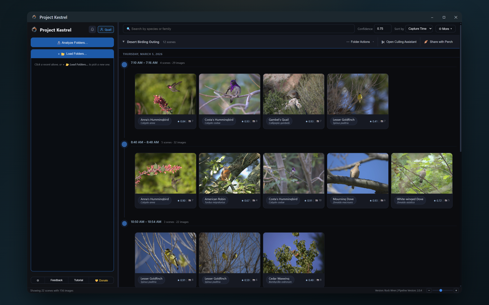
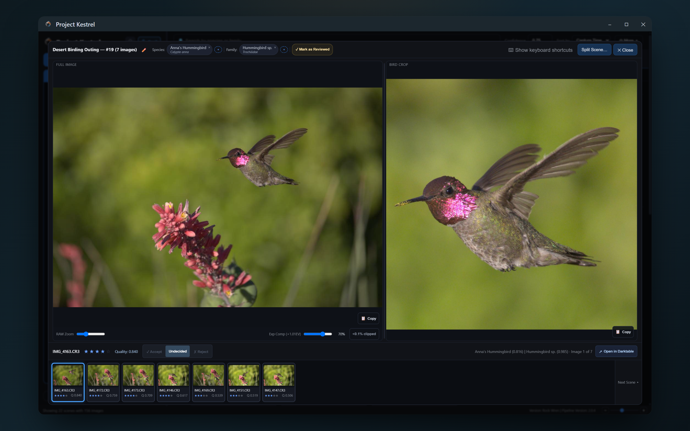
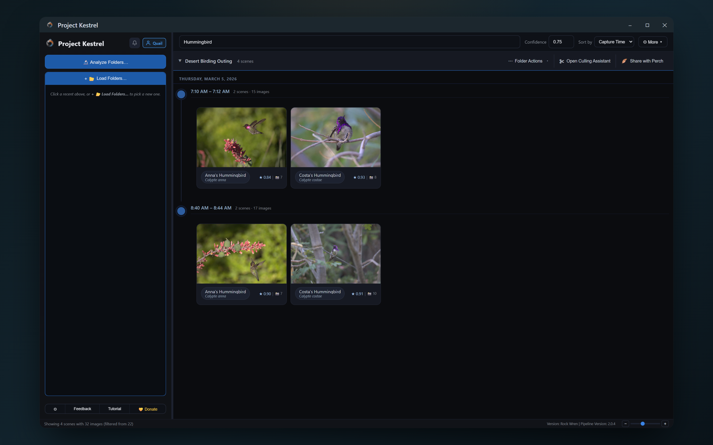
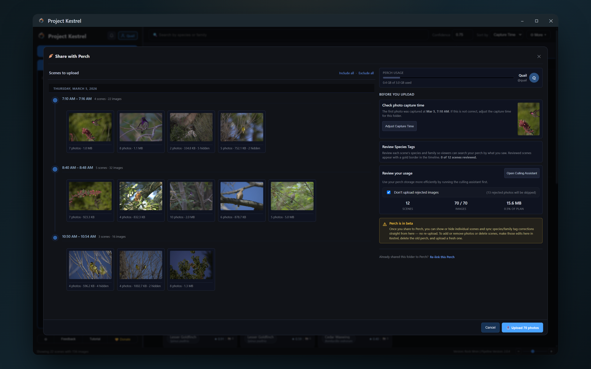
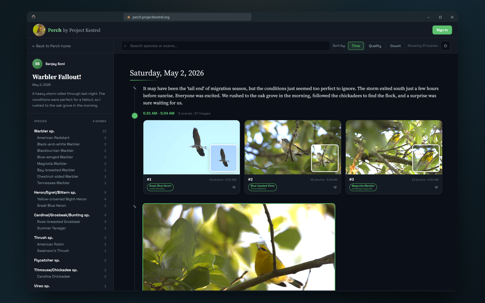

# Project Kestrel 🦅

Project Kestrel uses machine learning to organize your bird photo collection. It groups your bursts into scenes, ranks them by sharpness, and tags them by species — turning a chaotic card of thousands into a searchable, quality-sorted library. Then it helps you cull the blurry bulk, and share the outing as a story.


[Visit projectkestrel.org](https://projectkestrel.org) | [Download](https://projectkestrel.org/download) | [Perch](https://projectkestrel.org/perch) | [Cloud Compute](https://projectkestrel.org/cloud) | [Donate](https://donate.stripe.com/aFa28kbrLeb45mFgFE1ZS00)



## At a Glance

* ✅ **Sort by sharpness** to skip hours of tedious manual culling.
* ✅ **Instantly search** all your photography work by bird species or family.
* ✅ **Double-click** on any photo to open in your favorite editor.
* ✅ **Share your outing** as an interactive timeline with [Perch](https://projectkestrel.org/perch).
* ✅ **Local-first**: the desktop app is fully functional with no account, no internet, and no cloud — and it always will be.

## Get Started

| Platform | Where |
|---|---|
| **Windows** | [Microsoft Store](https://apps.microsoft.com/detail/9NQR2WFFNP5J) (auto-updates) or the [installer](https://projectkestrel.org/download?platform=windows) |
| **macOS** | [Download the DMG](https://projectkestrel.org/download?platform=macos) — Apple Silicon only; Intel Macs are not currently supported |
| **Linux** | Run from source — see [Running from Source](#-running-from-source) |

All builds are also on the [GitHub Releases page](https://github.com/SanjaySoniLV/ProjectKestrel/releases). Releases are named after birds; the current one is **v(Rock Wren)**. See the [changelog](https://projectkestrel.org/notes/?cat=changelog) for what's new, or the [guides](https://projectkestrel.org/notes/?cat=guides) if you're just getting started.

## Tutorial: 6 Steps to Better Culling

### Step 1: Analyze your folders
Point Kestrel at the folders holding your RAW or JPEG photos. It reads every frame — grouping bursts into scenes, finding the bird, scoring sharpness, and tagging the species.

### Step 2: Explore your library
Your outing comes back as a quality-sorted timeline: scenes grouped by time, each ranked sharpest-first, every bird labelled with its species and a confidence score.


### Step 3: Review the scene
Kestrel shows a close-up of the bird alongside the full frame. Because the scene is already sorted by sharpness, you're deciding on pose, light, and artistic preference — not pixel-peeping.


### Step 4: Cull the bulk
The Culling Assistant splits your photos into Accept and Reject piles from simple rules — a minimum quality bar, and how many frames to keep per scene. Adjust, review the rejects, click Done.

**Kestrel moves. It never deletes.** Rejected photos go to a `Kestrel Rejects` folder. Archive them or delete them yourself, whenever you're ready, on your own terms.


### Step 5: Search by species
Search your whole library by *what* you photographed, not *when*. Across every folder, every outing, every year of shooting.


### Step 6: Share it with Perch
Publish your outing as an interactive timeline anyone can explore — see [Perch](#perch) below.


---

## Features

- **Automatic Bird Detection**: Kestrel finds exactly where the bird is in your photo and focuses its analysis there.
- **Family & Species Search**: Classifies birds so you can filter your library by species or family keywords. Automatic classification currently covers **North American** species; you can manually tag any bird on Earth from a bundled catalog of ~11,250 species, searchable by common name, four-letter banding code, or scientific name.
- **Objective Quality Ranking**: Only considers sharpness, motion blur, and noise, letting you keep full artistic control.
- **Intelligent Scene Grouping**: Bursts are grouped automatically so you can compare similar frames side-by-side.
- **Editor Sync**: Kestrel writes XMP sidecar files natively supported by almost all photo editors — your ratings show up as stars in Lightroom, Darktable, Capture One, and more.
- **RAW File Support**: Processes CR2, CR3, NEF, ARW, DNG, and other RAW formats using the `rawpy` library.

> On species accuracy: family-level search is fairly reliable and a good primary tool for narrowing your library. Species-level results are useful for narrowing searches, but treat them as a starting point, not a definitive ID.

## Perch

[Perch](https://projectkestrel.org/perch) is a sharing platform built on Project Kestrel that lets you tell the *story* of a birding outing.

Most photo sharing means picking one shot and posting it. But an outing is a whole story — dozens of scenes, common and rare, across a single morning. Perch lets you share the entire experience: an interactive, personalized timeline that anyone can explore. Friends can like their favorites and leave comments. There's no feed to scroll, nothing deciding what you see, and no pressure to perform.



Perch uploads **only the lightweight thumbnails, never your originals**. You choose who sees a Perch — private, unlisted, specific people, or fully public — and you can change your mind at any time. Free for everyone, 3 GB (~15,000 photos) per account, no ads.

Live at [perch.projectkestrel.org](https://perch.projectkestrel.org).

## Cloud Compute

Project Kestrel is free and runs entirely on your own machine — always. But when you've got a huge backlog or a slow laptop, [Cloud Compute](https://projectkestrel.org/cloud) sends your photos to fast GPUs running the exact same pipeline, then sends the results right back. Up to **5–10× faster**, and completely optional.

A 2,000-photo backlog takes roughly 2.5 hours on a laptop, or about 15 minutes on Cloud Compute. Your upload is split across up to three parallel GPUs and merged back, identical to a local run.

**Your photos are deleted the moment they're analyzed.** Results are deleted on download, or after 30 days. All that's kept is job records — counts and timestamps for billing.

Every new account gets 2,500 images free, no card required. Cloud Compute is 100% optional — and it's the only thing funding Project Kestrel. The app itself stays free and open source for everyone, forever. Find it in the Analyze Folders dialog, or read more at [projectkestrel.org/cloud](https://projectkestrel.org/cloud).

## 🚀 Running from Source

If you are on Linux or prefer to run from source code, follow these steps:

### Prerequisites
- Python 3.11
- Git (for cloning)

### Installation

1. Clone the repository:
```bash
git clone https://github.com/SanjaySoniLV/ProjectKestrel.git
cd ProjectKestrel
```

2. Install dependencies for your platform:
```bash
pip install -r requirements-windows.txt   # Windows (DirectML)
pip install -r requirements-macos.txt     # macOS (CoreML / Apple Silicon)
pip install -r requirements.txt           # generic / Linux from source
```

### Usage

Launch the application:
```bash
python analyzer/visualizer.py
```

Or run the analyzer headless on a folder:
```bash
python analyzer/cli.py "/path/to/photos" --gpu
```

Security baseline:
- Project Kestrel runs in desktop mode via pywebview; the UI talks to Python over the `window.pywebview.api` bridge.
- Browser-only fallback mode is no longer supported, and the legacy HTTP control API is permanently disabled by design.
- Analysis runs fully offline. Sign-in, Perch, and Cloud Compute are the only features that use the network, and all three are optional.

## How It Works

Kestrel runs a four-stage pipeline that builds objective data about every frame.

### 1. Wildlife detection and segmentation
- Uses Google's [SpeciesNet](https://github.com/google/cameratrapai) ensemble (MegaDetector + species classifier) for animal bounding boxes and taxonomy, and [SAM-HQ](https://github.com/SysCV/sam-hq) (ViT-Tiny, via ONNX) for high-quality masks.
- Detects animals, routes birds vs other wildlife, and segments subjects so quality is assessed on wildlife pixels, not background — a busy or cluttered background never sways the score.

### 2. Species Classification
- A custom machine learning model was trained for bird species identification for North American birds.
- Improvements to classification are planned, including wider automatic coverage.

### 3. Quality Assessment
- A custom machine learning model was trained to analyze the quality of the images.
- Factors in noise, motion blur, out-of-focus images, and other artifacts into one score.
- Only evaluates image regions corresponding to the bird, NOT any branches, backgrounds, or other regions.
- Quality scores are used to rank images within a scene by sharpness.

### 4. Scene Grouping
- A custom image similarity algorithm was developed to identify images that belong to the same scene.
- Bursts are automatically grouped together, allowing their relative quality to be ranked with ease.

## Project Structure

```
ProjectKestrel/
├── analyzer/                 # Single unified app (desktop UI + CLI + pipeline)
│   ├── visualizer.py         # App entry: launches the pywebview window
│   ├── api_bridge.py         # JS↔Python bridge (Api class exposed to the UI)
│   ├── queue_manager.py      # Sequential folder-analysis queue
│   ├── settings_utils.py     # settings.json I/O with schema validation
│   ├── cli.py                # Headless CLI entry
│   ├── visualizer.html       # UI markup (all dialogs live here)
│   ├── js/                   # UI logic — vanilla JS modules, no framework
│   ├── css/                  # Split stylesheets (base, layout, grid, dialogs/…)
│   ├── culling.html          # Culling Assistant window
│   ├── metadata_writer.py    # XMP sidecar writer
│   ├── editor_launch.py      # Open photos in external editors
│   ├── cloud_compute_client.py  # Cloud Compute (optional)
│   ├── perch_uploader.py     # Perch publishing (optional)
│   ├── auth_client.py        # Sign-in (optional)
│   ├── models/               # AI model files (ONNX + SpeciesNet)
│   ├── kestrel_analyzer/     # Core analysis pipeline (no UI dependencies)
│   └── tests/                # pytest suites (~350 tests)
├── packaging/                # PyInstaller specs + installer build scripts
├── tools/                    # Build + asset tooling (bird catalog, screenshots)
├── utils/                    # Developer utility scripts
├── release-notes/            # Per-release notes, named by bird
├── test_imgs/                # Tiny smoke-test images for CI
└── README.md
```

## Supported File Formats

Kestrel's quality scoring model is trained on RAW images, and may not work as well for JPG images (but can still be used). Kestrel uses rawpy to read RAW files. If your camera's RAW format is not listed below, please create a pull request, and we will add it to the list.

**RAW Formats** (preferred):
- Canon: `.cr2`, `.cr3`
- Nikon: `.nef`
- Sony: `.arw`
- Adobe: `.dng`
- Olympus: `.orf`
- Fuji: `.raf` *
- Panasonic: `.rw2`
- Pentax: `.pef`
- Samsung: `.sr2`, `.srw`
- Sigma: `.x3f` *

> &ast; For `.raf` and `.x3f`, Kestrel's native capture-time parser does not
> yet support the EXIF layout used by these formats. The images analyze
> normally, but scene grouping falls back to image-feature similarity
> instead of using EXIF timestamps. Full timestamp support is planned.

> Note: If this list does not support your camera's RAW file, please reach out via the email below. It is easy to add new RAW file formats thanks to the rawpy library.

**Standard Formats** (fallback):
- JPEG: `.jpg`, `.jpeg`
- PNG: `.png`

## 🔧 Configuration

### GPU Acceleration
GPU acceleration is supported out of the box in the distributed builds, and every model runs on it. Kestrel uses ONNX Runtime with a platform-appropriate execution provider:

- **macOS**: CoreML (Apple GPU / Neural Engine)
- **Windows**: DirectML (any DirectX 12 GPU — AMD, Intel, or NVIDIA)

Kestrel falls back to the CPU execution provider automatically when no compatible GPU is available, so it works on any machine. GPU is on by default; if you hit trouble, untick **Use GPU** in the Analyze Folders dialog, or pass `--no-gpu` on the CLI.

If you're running from source, install the right requirements file for your platform — `requirements-windows.txt` pulls `onnxruntime-directml`, while `requirements-macos.txt` uses the stock `onnxruntime`, which ships CoreML on macOS. The generic `requirements.txt` is CPU-only.

> Even with a GPU, a big backlog takes a while on a laptop. [Cloud Compute](#cloud-compute) runs the same pipeline on dedicated GPUs if you want it faster.

### Output Structure
Processed images are organized in a `.kestrel` folder within your photo directory:
```
your_photos/
├── .kestrel/
│   ├── export/           # Resized JPEG exports
│   ├── crop/            # Cropped bird images
│   └── kestrel_database.csv  # Analysis results
└── [your original photos]
```

The `.kestrel` folder will require an additional 1MB of disk space for every ~100MB of RAW files. This folder may also include error or warning logs.

## 🤝 Contributing

Contributions are welcome! Please feel free to submit pull requests, report bugs, or suggest features.

Project Kestrel is a one-person project — built over years of weekends because I wanted these tools for my own bird photography. The app is free and open source, and always will be; my only sources of income are your donations and your subscriptions to Cloud Compute. There are [many ways to support it](https://projectkestrel.org/support-me), and money is only one of them — but if you'd like to, you can [donate via card](https://donate.stripe.com/aFa28kbrLeb45mFgFE1ZS00).

## ❓ Contact Me
Direct questions or comments to [support@projectkestrel.org](mailto:support@projectkestrel.org)

## 📄 License

This project is licensed under the **GNU Affero General Public License v3.0 (AGPLv3)** — see the [LICENSE](LICENSE) file for the full text. The AGPL adds a "network use" clause to the standard GPL: if you run a modified version of Project Kestrel as a network service, you must offer the source of your modifications to the users of that service.

**Brand assets are not covered by the AGPLv3.** The "Project Kestrel", "Perch", and "Cloud Compute" names, logos, and other brand/visual-identity assets (including the files in [`assets/`](assets/)) are proprietary and all rights reserved — see [`assets/LICENSE`](assets/LICENSE). The AGPLv3 covers the source code only; it does not grant any right to use the names or brand. You may fork and redistribute the code, but not under the Project Kestrel, Perch, or Cloud Compute brand.

Copyright © 2026 Project Kestrel LLC.

## 📜 Terms of Use & Privacy Policy

The canonical Terms of Service and Privacy Policy live on the marketing site and apply to the desktop app, Perch, and Cloud Compute:

- **Terms of Service**: https://projectkestrel.org/terms-of-use
- **Privacy Policy**: https://projectkestrel.org/privacy-policy

## 🙏 Acknowledgments

- **rawpy** library for robust RAW image file format handling
- **pyinstaller project** for robust python packaging and distribution solutions.

### Bundled bird-catalog data

The global species combobox (region-filtered, fuzzy-searchable, with optional
italicised scientific names) is powered by data bundled in
`analyzer/models/birds/birds_global.csv`. That CSV is built by
`tools/build_bird_catalog.py` from these authoritative sources:

- **IOC World Bird List (v15.1)** — Frank Gill, David Donsker & Pamela
  Rasmussen (Eds). 2025. doi:[10.14344/IOC.ML.15.1](https://doi.org/10.14344/IOC.ML.15.1).
  [worldbirdnames.org](https://www.worldbirdnames.org/). Licensed under
  [CC BY 3.0](https://creativecommons.org/licenses/by/3.0/). Provides common
  names, scientific binomials, taxonomic order/family/genus, and the
  biogeographic breeding-range codes used by the region selector.
- **IBP-AOS Alpha Codes** — Pyle, P. and DeSante, D.F. *Four-letter (English
  Name) and Six-letter (Scientific Name) Alpha Codes for North American
  Birds.* The Institute for Bird Populations. [birdpop.org](https://www.birdpop.org/).
  Per the 66th AOS Supplement (2025). Provides the 4-letter banding codes
  surfaced in the combobox (e.g. typing `AMRO` → American Robin).

See [`analyzer/models/birds/NOTICES.md`](analyzer/models/birds/NOTICES.md)
for the full attribution.

---

**Note**: This project is designed primarily for bird photography analysis. Functionality for other wildlife is in alpha stage, but will still function. Try it on your photos of wildlife!
