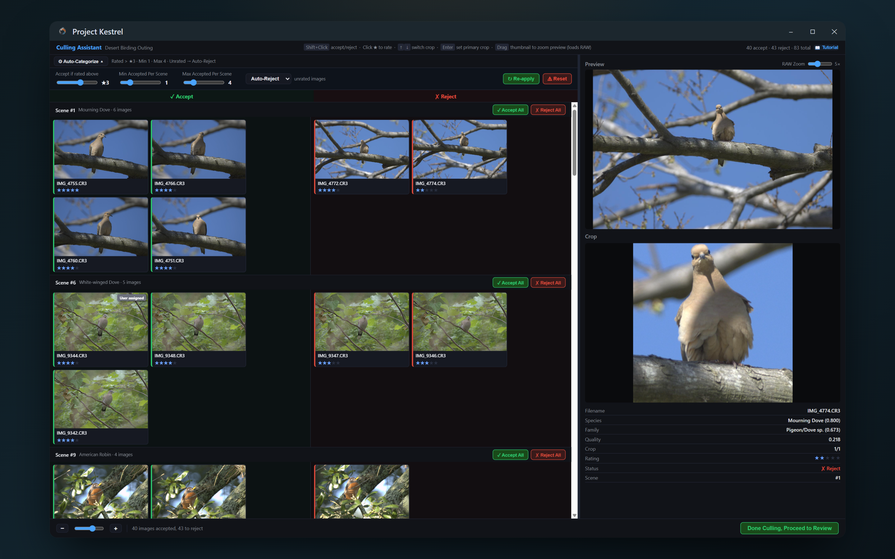

# Project Kestrel 🦅

Project Kestrel uses machine learning to organize your bird photo collection. By grouping similar photos together, ranking them by sharpness, and tagging them by bird species, Kestrel turns your photography into a searchable, quality-sorted, and interactive library.


[Visit Projectkestrel.org](https://projectkestrel.org) | [Donate](https://www.paypal.com/donate/?hosted_button_id=CXH4FE5AKZD3A)

## At a Glance

* ✅ **Sort by sharpness** to skip hours of tedious manual culling.
* ✅ **Instantly search** all your photography work by bird species or family.
* ✅ **Double-click** on any photo to open in your favorite editor.
* ✅ **100% Local**: All processing is done locally on your device.

## Get Started

For the best experience, download the latest version for your platform from [ProjectKestrel.org](https://projectkestrel.org/download) or the [GitHub Releases page](https://github.com/SanjaySoniLV/ProjectKestrel/releases).

Project Kestrel is now a single, unified application for analyzing and exploring your photos.

## Tutorial: 5 Steps to Better Culling

### Step 1: Install & Open
Download and install Kestrel, then launch the application to get started.


### Step 2: Analyze Folders
Select the folders containing your RAW or JPEG photos. Kestrel will scan them, detecting birds and estimating image quality.


### Step 3: Explore Results
Browse your collection! Photos are automatically grouped by "scene" (bursts) and organized from sharpest to blurriest.


### Step 4: Rapid Culling
Use the Culling Assistant to quickly split photos into "Accept" and "Reject" groups.


### Step 5: Search & Discover
Search through thousands of photos by species or family to instantly rediscover shots from any outing.


---

## Features

- **Automatic Bird Detection**: Kestrel finds exactly where the bird is in your photo and focuses its analysis there.
- **Family & Species Search**: Classifies birds so you can filter your library by species or family keywords.
- **Objective Quality Ranking**: Only considers sharpness, motion blur, and noise, letting you keep full artistic control.
- **Intelligent Scene Grouping**: Bursts are grouped automatically so you can compare similar frames side-by-side.
- **RAW File Support**: Processes CR2, CR3, NEF, ARW, DNG, and other RAW formats using the `rawpy` library.

## 🚀 Running from Source

If you are on Linux or prefer to run from source code, follow these steps:

### Prerequisites
- Python 3.12+
- Git (for cloning)

### Installation

1. Clone the repository:
```bash
git clone https://github.com/SanjaySoniLV/ProjectKestrel.git
cd ProjectKestrel
```

2. Install dependencies:
```bash
pip install -r requirements.txt
```

### Usage

Launch the unified application:
```bash
python analyzer/visualizer.py
```
*(Note: In the unified version, the visualizer serves as the main entry point for both analysis and browsing.)*

Security baseline:
- Project Kestrel runs in desktop mode via pywebview.
- Browser-only fallback mode is no longer supported.
- The app is intended to run fully offline once dependencies are installed.

Features of the visualizer:
- **Scene View**: Browse grouped similar images
- **Species Search**: Filter by bird species keywords
- **Quality Sorting**: Images automatically sorted by quality score
- **Detailed View**: Examine individual images with metadata
- **External Tools**: Open original files or simply double-click to launch Darktable

## How It Works

### 1. Wildlife detection and segmentation
- Uses Google's [SpeciesNet](https://github.com/google/cameratrapai) ensemble (MegaDetector + species classifier) for animal bounding boxes and taxonomy, and [SAM-HQ](https://github.com/SysCV/sam-hq) (ViT-B) for high-quality masks.
- Detects animals, routes birds vs other wildlife, and segments subjects so quality is assessed on wildlife pixels, not background.

### 2. Species Classification
- A custom machine learning model was trained for bird species identification for North American birds.
- Improvements to classification are planned.

### 3. Quality Assessment
- A custom machine learning model was trained to analyze the quality of the images.
- Factors in noise, motion blur, out-of-focus images, and other artifacts into one score.
- Only evaluates image regions corresponding to the bird, NOT any branches, backgrounds, or other regions.
- Quality scores are used to rank images within a scene by sharpness.

### 4. Scene Grouping
- A custom image similarity algorithm was developed to identify images that belong to the same scene.
- Bursts are automatically grouped together, allowing their relative quality to be ranked with ease.

## Project Structure

```
ProjectKestrel/
├── analyzer/                 # Single unified app (desktop UI + CLI + pipeline)
│   ├── visualizer.py         # App entry: launches the pywebview window
│   ├── api_bridge.py         # JS↔Python bridge (Api class exposed to the UI)
│   ├── queue_manager.py      # Sequential folder-analysis queue
│   ├── settings_utils.py     # settings.json I/O with schema validation
│   ├── cli.py                # Headless CLI entry
│   ├── visualizer.html       # UI markup
│   ├── visualizer.js         # UI logic (vanilla JS)
│   ├── visualizer.css        # UI styles
│   ├── culling.html          # Culling Assistant window
│   ├── metadata_writer.py    # XMP sidecar writer
│   ├── editor_launch.py      # Open photos in external editors
│   ├── models/               # AI model files (ONNX + SpeciesNet)
│   ├── kestrel_analyzer/     # Core analysis pipeline (no UI dependencies)
│   └── tests/                # pytest + unittest test suites
├── packaging/                # PyInstaller specs + installer build scripts
├── utils/                    # Developer utility scripts
├── test_imgs/                # Tiny smoke-test images for CI
└── README.md
```

## Supported File Formats

Kestrel's quality scoring model is trained on RAW images, and may not work as well for JPG images (but can still be used). Kestrel uses rawpy to read RAW files. If your camera's RAW format is not listed below, please create a pull request, and we will add it to the list.

**RAW Formats** (preferred):
- Canon: `.cr2`, `.cr3`
- Nikon: `.nef`
- Sony: `.arw`
- Adobe: `.dng`
- Olympus: `.orf`
- Fuji: `.raf` *
- Panasonic: `.rw2`
- Pentax: `.pef`
- Samsung: `.sr2`, `.srw`
- Sigma: `.x3f` *

> &ast; For `.raf` and `.x3f`, Kestrel's native capture-time parser does not
> yet support the EXIF layout used by these formats. The images analyze
> normally, but scene grouping falls back to image-feature similarity
> instead of using EXIF timestamps. Full timestamp support is planned.

> Note: If this list does not support your camera's RAW file, please reach out via the email below. It is easy to add new RAW file formats thanks to the rawpy library.

**Standard Formats** (fallback):
- JPEG: `.jpg`, `.jpeg`
- PNG: `.png`

## 🔧 Configuration

### GPU Acceleration
GPU is currently NOT supported in the distributed versions of Project Kestrel. GPU may be supported in a future date, but for now, the only option to use GPU is to run Kestrel from source. This will contribute marginal improvements to analysis times, but requires a capable system, and is extremely unstable/not formally supported at this time. To do this, when running the analyzer, you'll be prompted to choose between:
- **GPU Mode**: Uses DirectML on Windows (faster, requires compatible GPU and Windows OS)
- **CPU Mode**: Uses CPU execution provider (slightly, but works on all systems)

> NOTE: Not all models are run on the GPU, and GPU acceleration is in Beta development and may be unstable. If you run into errors or instability, please use CPU mode.

### Output Structure
Processed images are organized in a `.kestrel` folder within your photo directory:
```
your_photos/
├── .kestrel/
│   ├── export/           # Resized JPEG exports
│   ├── crop/            # Cropped bird images
│   └── kestrel_database.csv  # Analysis results
└── [your original photos]
```

The `.kestrel` folder will require an additional 1MB of disk space for every ~100MB of RAW files. This folder may also include error or warning logs.

## 🤝 Contributing

Contributions are welcome! Please feel free to submit pull requests, report bugs, or suggest features.

Donations are welcome. Please donate via [PayPal/Card](https://www.paypal.com/donate/?hosted_button_id=CXH4FE5AKZD3A)

## ❓ Contact Me
Direct questions or comments to [support@projectkestrel.org](mailto:support@projectkestrel.org)

## 📄 License

This project is licensed under the **GNU Affero General Public License v3.0 (AGPLv3)** — see the [LICENSE](LICENSE) file for the full text. The AGPL adds a "network use" clause to the standard GPL: if you run a modified version of Project Kestrel as a network service, you must offer the source of your modifications to the users of that service.

Copyright © 2026 Project Kestrel LLC.

## 📜 Terms of Use & Privacy Policy

The canonical Terms of Service and Privacy Policy live on the marketing site and apply to the desktop app, Perch, and Cloud Compute:

- **Terms of Service**: https://projectkestrel.org/terms-of-use
- **Privacy Policy**: https://projectkestrel.org/privacy-policy

## 🙏 Acknowledgments

- **rawpy** library for robust RAW image file format handling
- **pyinstaller project** for robust python packaging and distribution solutions.

### Bundled bird-catalog data

The global species combobox (region-filtered, fuzzy-searchable, with optional
italicised scientific names) is powered by data bundled in
`analyzer/models/birds/birds_global.csv`. That CSV is built by
`tools/build_bird_catalog.py` from these authoritative sources:

- **IOC World Bird List (v15.1)** — Frank Gill, David Donsker & Pamela
  Rasmussen (Eds). 2025. doi:[10.14344/IOC.ML.15.1](https://doi.org/10.14344/IOC.ML.15.1).
  [worldbirdnames.org](https://www.worldbirdnames.org/). Licensed under
  [CC BY 3.0](https://creativecommons.org/licenses/by/3.0/). Provides common
  names, scientific binomials, taxonomic order/family/genus, and the
  biogeographic breeding-range codes used by the region selector.
- **IBP-AOS Alpha Codes** — Pyle, P. and DeSante, D.F. *Four-letter (English
  Name) and Six-letter (Scientific Name) Alpha Codes for North American
  Birds.* The Institute for Bird Populations. [birdpop.org](https://www.birdpop.org/).
  Per the 66th AOS Supplement (2025). Provides the 4-letter banding codes
  surfaced in the combobox (e.g. typing `AMRO` → American Robin).

See [`analyzer/models/birds/NOTICES.md`](analyzer/models/birds/NOTICES.md)
for the full attribution.

---

**Note**: This project is designed primarily for bird photography analysis. Functionality for other wildlife is in alpha stage, but will still function. Try it on your photos of wildlife!
